# 🔍 مراجعة شاملة لتطبيق ERP

---

## 📐 تقييم البنية المعمارية (Architecture)

البنية ممتازة وتتبع أنماط تصميم احترافية:
- ✅ **Clean Architecture** مع فصل واضح بين الطبقات (Core → Application → Infrastructure → API)
- ✅ **CQRS** مع MediatR (Commands/Queries + Handlers)
- ✅ **Result Pattern** لإدارة الأخطاء بدون Exceptions
- ✅ **Soft Delete** عبر `BaseEntity`
- ✅ **FluentValidation** للتحقق من المدخلات
- ✅ **Pagination** عبر `PagedResult<T>`

---

## 🐛 أخطاء حرجة يجب إصلاحها (Critical Bugs)

### 1. ❌ Bug: خطأ في `ProductRepo.Delete()` — يستدعي SP خاطئ

```csharp
// ProductRepo.cs:82 — يستدعي SP_AddNewProduct بدلاً من SP لحذف المنتج!
using (SqlCommand command = new SqlCommand("SP_AddNewProduct", connection))
```

هذا يعني أن حذف المنتج حالياً **يضيف منتج جديد** بدلاً من حذفه! يجب تغييره إلى SP صحيح مثل `SP_DeleteProduct`.

---

### 2. ❌ Bug: `UserRepo.GetById()` و `GetByEmail()` يُرجعان `DateTime.UtcNow` بدل `CreatedAt` الفعلي

```csharp
// UserRepo.cs:68 — يستخدم DateTime.UtcNow بدل u.CreatedAt
CreatedAt = DateTime.UtcNow  // ❌ خطأ
```
> [!CAUTION]
> هذا يعني أن كل مرة تطلب فيها بيانات مستخدم، سيظهر تاريخ الإنشاء كالوقت الحالي وليس التاريخ الحقيقي.

لكن الكيان `User` لا يرث من `BaseEntity` أصلاً ولا يملك `CreatedAt`. هذه مشكلة تصميمية أيضاً (أنظر النقطة التالية).

---

### 3. ❌ Bug: كيان `User` لا يرث من `BaseEntity`

```csharp
public class User  // ❌ لا يرث BaseEntity
{
    public string Id { get; set; } = string.Empty;
    // ...
}
```

جميع الكيانات الأخرى ترث من `BaseEntity` ما عدا `User`. هذا يعني أن `User`:
- لا يملك `CreatedAt`, `IsDeleted`, `DeletedAt`
- حذفه يتم بشكل **Hard Delete** وليس Soft Delete (في `UserRepo.Delete()` يستخدم `_Context.Users.Remove()`)
- لا يدعم تتبع من أنشأه

---

### 4. ❌ خطأ إملائي متكرر: `FristName` بدل `FirstName`

```csharp
// Customer.cs:10
public string FristName { get; set; }  // ❌ يجب أن تكون FirstName

// User.cs:11
public string FristName { get; set; }  // ❌ نفس الخطأ
```

> [!WARNING]
> هذا الخطأ موجود أيضاً في: `UserRepo`, `UserDTO`, `AddUserParams`, `UpdateUserParams`، وجميع الملفات التي تشير لاسم المستخدم/العميل الأول.  
> تصحيحه يتطلب **Migration جديدة** لتغيير اسم العمود في قاعدة البيانات.

---

### 5. ❌ خطأ إملائي في اسم الكلاس: `BaseContoller` بدل `BaseController`

```csharp
public class BaseContoller : ControllerBase  // ❌ Contoller → Controller
```

---

### 6. ❌ خطأ إملائي متكرر في رسائل الخطأ

```csharp
// في جميع الـ Repos:
"Internel Error Happend"  // ❌ يجب: "Internal Error Happened"
"InternelError"           // ❌ يجب: "InternalError"
```

---

## ⚠️ مشاكل تصميمية مهمة (Design Issues)

### 1. غياب `UpdatedAt` في `BaseEntity`

```diff
 public class BaseEntity
 {
     public int Id { get; set; }
     public DateTime CreatedAt { get; set; } = DateTime.UtcNow;
+    public DateTime? UpdatedAt { get; set; }
+    public string? UpdatedByUserId { get; set; }
+    public virtual User? UpdatedByUser { get; set; }
     public bool IsDeleted { get; set; }
     // ...
 }
```

بدون `UpdatedAt`، لا يمكن تتبع آخر تعديل على أي سجل.

---

### 2. عدم وجود `UpdatedAt` في أي عملية Update

في جميع الـ Repos، عمليات `Update` لا تسجل وقت التعديل. مثال:
```csharp
// ProductRepo.cs:199-222
public async Task<Result<bool>> Update(int Id, UpdateProductParams Params)
{
    // ... تغيير القيم ...
    // ❌ لا يوجد: product.UpdatedAt = DateTime.UtcNow;
    _Context.Products.Update(product);
}
```

---

### 3. فتح اتصالات SQL مباشرة بدل استخدام DbContext

عدة Repos تفتح `SqlConnection` مباشرة لاستدعاء Stored Procedures:
```csharp
using (SqlConnection connection = new SqlConnection(_Config.GetConnectionString("MyConn")))
```

> [!IMPORTANT]
> هذا يتجاوز DbContext تماماً مما يعني:
> - لا يوجد **Transaction** مشترك مع عمليات EF Core
> - لا تتبع من **Change Tracker**
> 
> **الحل**: استخدم `_Context.Database.GetDbConnection()` أو `_Context.Database.ExecuteSqlRawAsync()` بدلاً من إنشاء اتصال منفصل.

---

### 4. عدم وجود Generic Base Repository

كل Repo يكرر نفس الكود (Add, Delete, GetById, GetPaged, Update). يمكن إنشاء:
```csharp
public abstract class BaseRepository<TEntity, TDto> where TEntity : BaseEntity
{
    // عمليات مشتركة: SoftDelete, GetById, GetPaged
}
```

---

### 5. الـ Validators غير مُفعّلة في Pipeline

`FluentValidation` مسجل لكن لا يوجد **MediatR Validation Pipeline Behavior**. الـ Validators لن يتم تنفيذها تلقائياً!

```diff
// ApplicationServiceRegistration.cs
services.AddMediatR(cfg => cfg.RegisterServicesFromAssembly(...));
services.AddValidatorsFromAssembly(...);
+ services.AddTransient(typeof(IPipelineBehavior<,>), typeof(ValidationBehavior<,>));
```

---

### 6. لا يوجد CORS Configuration

```csharp
// Program.cs — لا يوجد أي إعداد CORS
// ❌ أي Frontend سيواجه مشكلة CORS
```

---

### 7. لا يوجد Global Exception Handler Middleware

كل Repository يلتقط Exceptions بـ try-catch. الأفضل إضافة:
```csharp
app.UseExceptionHandler();
// أو Middleware مخصص
```

---

### 8. لا يوجد نظام Authentication/Authorization

```csharp
// Program.cs — لا يوجد:
// app.UseAuthentication();
// app.UseAuthorization();
```

جميع الـ Endpoints مفتوحة بدون حماية. لا يوجد JWT أو Identity.

---

## 🚀 Endpoints و Features مفقودة يجب إضافتها

### 🔴 أولوية عالية (Critical Missing)

| # | Feature | التفاصيل |
|---|---------|----------|
| 1 | **🔐 Authentication Controller** | `POST /api/Auth/login`, `POST /api/Auth/register`, `POST /api/Auth/refresh-token`, `POST /api/Auth/logout` — لا يوجد أي نظام تسجيل دخول حالياً |
| 2 | **🔐 Authorization & Roles** | نظام صلاحيات (Admin, Cashier, WarehouseManager, Accountant) — كل endpoint يجب حمايته بـ `[Authorize(Roles = "...")]` |
| 3 | **📦 Return Controller** | `Return` و `ReturnItem` كيانات موجودة في الـ Database لكن **لا يوجد Controller أو Repo أو Feature لهما!** يجب إضافة: `POST /api/Return`, `GET /api/Return/{id}`, `GET /api/Return`, `PUT /api/Return/{id}/approve`, `PUT /api/Return/{id}/reject` |
| 4 | **📦 StockAdjustmentLog Controller** | `StockAdjustmentLog` كيان موجود لكن **لا يوجد Controller أو Repo له!** يجب إضافة: `POST /api/StockAdjustment`, `GET /api/StockAdjustment`, `GET /api/StockAdjustment/by-product/{id}` |
| 5 | **📊 Dashboard / Reports Controller** | لا يوجد أي endpoint لتقارير العمل أو الإحصائيات |

---

### 🟡 أولوية متوسطة (Important Missing)

| # | Endpoint / Feature | التفاصيل |
|---|-------------------|----------|
| 6 | `GET /api/SalesOrder/{id}/items` | جلب عناصر طلب بيع معين مع تفاصيل المنتجات |
| 7 | `GET /api/SalesOrder/{id}/payments` | جلب المدفوعات المرتبطة بطلب بيع |
| 8 | `GET /api/PurchaseOrder/{id}/items` | جلب عناصر طلب شراء معين |
| 9 | `GET /api/PurchaseOrder/{id}/payments` | جلب المدفوعات المرتبطة بطلب شراء |
| 10 | `PUT /api/PurchaseOrder/{id}` | تحديث طلب شراء (الـ Update موجود في Repo لكن غير موجود في Controller!) |
| 11 | `DELETE /api/PurchaseOrder/{id}` | حذف طلب شراء (الـ Delete موجود في Repo لكن غير موجود في Controller!) |
| 12 | `PUT /api/SalesOrder/{id}/status` | تحديث حالة طلب البيع (Pending → Confirmed → Completed) |
| 13 | `PUT /api/PurchaseOrder/{id}/status` | تحديث حالة طلب الشراء |
| 14 | `GET /api/Customer/{id}/orders` | جلب جميع طلبات عميل معين |
| 15 | `GET /api/Customer/{id}/balance` | حساب رصيد العميل (الديون المتبقية) |
| 16 | `GET /api/Supplier/{id}/orders` | جلب جميع طلبات مورد معين |
| 17 | `GET /api/Inventory/low-stock` | جلب المنتجات التي وصلت لحد أدنى (`MinThreshold` موجود لكن غير مستخدم!) |
| 18 | `GET /api/Inventory/by-warehouse/{warehouseId}` | جلب جميع المخزون لمستودع معين |
| 20 | `GET /api/Product/search?q=` | بحث عام في المنتجات (الحالي يبحث بالاسم أو الباركود فقط) |

---

### 🟢 أولوية منخفضة (Nice to Have)

| # | Endpoint / Feature | التفاصيل |
|---|-------------------|----------|
| 21 | **📊 Dashboard Endpoints** | `GET /api/Dashboard/summary` — إجمالي المبيعات، المشتريات، عدد العملاء، المنتجات الأكثر مبيعاً |
| 22 | **📊 Sales Report** | `GET /api/Report/sales?from=&to=` — تقرير المبيعات حسب فترة زمنية |
| 23 | **📊 Purchase Report** | `GET /api/Report/purchases?from=&to=` — تقرير المشتريات |
| 24 | **📊 Inventory Report** | `GET /api/Report/inventory-value` — قيمة المخزون الإجمالية |
| 25 | **📊 Profit Report** | `GET /api/Report/profit?from=&to=` — تقرير الأرباح (SellingPrice - CostPrice) |
| 26 | **🧾 Invoice Generation** | `GET /api/SalesOrder/{id}/invoice` — إنشاء فاتورة (PDF أو HTML) |
| 27 | **📧 Notification System** | تنبيهات عند انخفاض المخزون، طلبات جديدة |
| 28 | **📋 Audit Log** | تسجيل جميع العمليات (من فعل ماذا ومتى) |
| 29 | **🔍 Product by Category** | `GET /api/Product/by-category/{categoryId}` |
| 30 | **🔍 Product by Brand** | `GET /api/Product/by-brand/{brandId}` |
| 31 | **📤 Export Endpoints** | `GET /api/Report/sales/export?format=csv` |
| 32 | **❤️ Health Check** | `GET /api/health` — للتأكد من حالة الخادم |

---

## 🛠️ تحسينات تقنية مقترحة

### 1. إضافة Validation Pipeline Behavior

```csharp
public class ValidationBehavior<TRequest, TResponse> : IPipelineBehavior<TRequest, TResponse>
    where TRequest : IRequest<TResponse>
{
    private readonly IEnumerable<IValidator<TRequest>> _validators;
    
    public ValidationBehavior(IEnumerable<IValidator<TRequest>> validators)
        => _validators = validators;

    public async Task<TResponse> Handle(TRequest request, 
        RequestHandlerDelegate<TResponse> next, CancellationToken ct)
    {
        var context = new ValidationContext<TRequest>(request);
        var failures = _validators
            .Select(v => v.Validate(context))
            .SelectMany(r => r.Errors)
            .Where(f => f != null)
            .ToList();

        if (failures.Any())
            throw new ValidationException(failures);

        return await next();
    }
}
```

---

### 2. إضافة CORS

```csharp
// Program.cs
builder.Services.AddCors(options =>
{
    options.AddPolicy("AllowFrontend", policy =>
    {
        policy.WithOrigins("http://localhost:3000")
              .AllowAnyHeader()
              .AllowAnyMethod();
    });
});
// ...
app.UseCors("AllowFrontend");
```

---

### 3. إضافة Global Exception Handler

```csharp
app.UseExceptionHandler(appError =>
{
    appError.Run(async context =>
    {
        context.Response.StatusCode = 500;
        context.Response.ContentType = "application/json";
        var error = context.Features.Get<IExceptionHandlerFeature>();
        if (error != null)
        {
            await context.Response.WriteAsJsonAsync(new
            {
                StatusCode = 500,
                Message = "Internal Server Error"
            });
        }
    });
});
```

---

### 4. إضافة `Supplier` Contact Info

```diff
 public class Supplier : BaseEntity
 {
     public string FirstName { get; set; } = string.Empty;
     public string LastName { get; set; } = string.Empty;
     public string FullName { get; set; } = string.Empty;
+    public string? Email { get; set; }
+    public string? PhoneNumber { get; set; }
+    public string? Address { get; set; }
     public virtual ICollection<PurchaseOrder> PurchaseOrders { get; set; }
 }
```

---

### 5. `Warehouse` يحتاج معلومات إضافية

```diff
 public class Warehouse : BaseEntity
 {
     public string Name { get; set; } = string.Empty;
+    public string? Location { get; set; }
+    public string? Description { get; set; }
+    public bool IsActive { get; set; } = true;
     public virtual Setting? Setting { get; set; }
     public virtual ICollection<Inventory> Inventory { get; set; }
 }
```

---

### 6. `Customer` يحتاج Email

```diff
 public class Customer : BaseEntity
 {
-    public string FristName { get; set; } = string.Empty;
+    public string FirstName { get; set; } = string.Empty;
     public string LastName { get; set; } = string.Empty;
     public string Info { get; set; } = string.Empty;
+    public string? Email { get; set; }
     public decimal? CreditLimit { get; set; }
 }
```

---

## 📋 ملخص الأولويات

```mermaid
graph TD
    A["🔴 أولوية قصوى"] --> B["إصلاح Bug: ProductRepo.Delete يستدعي SP_AddNewProduct"]
    A --> C["إصلاح Bug: User لا يرث BaseEntity"]
    A --> D["إضافة Authentication/Authorization"]
    A --> E["إضافة Return Controller (كيان موجود بدون API)"]
    A --> F["تفعيل Validation Pipeline"]
    
    G["🟡 أولوية متوسطة"] --> H["إضافة StockAdjustmentLog Controller"]
    G --> I["إضافة Endpoints فرعية للطلبات"]
    G --> J["إضافة Low Stock Alert"]
    G --> K["إضافة CORS + Error Handler"]
    G --> L["إصلاح الأخطاء الإملائية (FristName)"]
    
    M["🟢 أولوية منخفضة"] --> N["Dashboard/Reports"]
    M --> O["Invoice Generation"]
    M --> P["Export CSV/PDF"]
    M --> Q["Health Check"]
```



---

> [!TIP]
> أقترح البدء بإصلاح الـ Bugs الحرجة أولاً (خاصة `ProductRepo.Delete()`)، ثم إضافة Authentication، ثم Return Controller. هل تريد أن أبدأ بتنفيذ أي من هذه التحسينات؟
